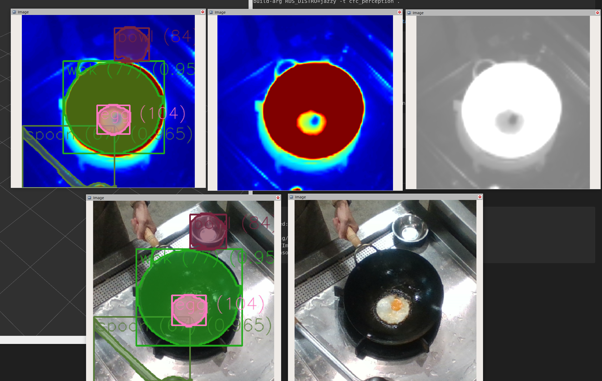
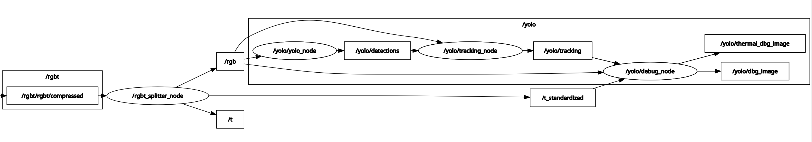

# Perception Take Home Project

This is based on [yolo_ros](https://github.com/mgonzs13/yolo_ros), a ROS 2 wrapper for YOLO models from [Ultralytics](https://github.com/ultralytics/ultralytics). The original README is [here](./Original_README.md)

## Table of Contents

* [Background](#background)
* [Tasks](#tasks)
* [Outcome](#outcome)
* [Usage](#usage)
* [DataFlow and topics](#dataflow-and-topics-selective)


## Background
以下描述在開始著手作業前我在各方面的評估以及當時技術的狀況
* 我知道Yolo系列的模型一般來說是可以優先嘗試的選擇
* 我認為以我現有的資源與時間，能做到的是Fine-tuning
* 高品質的資料最終會決定訓練成果，但我個人從沒進行過影像貼標，這會是這次比較大的風險
* 我有注意到近年來SAM與多模態模型的出現，讓貼標可能更有效率
* 安裝與執行開源很可能要處理很多依賴的問題，而DL模型還要考慮資源問題，這也是一個比較大的風險
* 對於ROS2的操作我很有信心，不會是問題
* 情境題需要好的點子，要提早開始


## Tasks
根據[Background](#Background)，我優先Study近年SAM與多模態模型的出現具體對貼標效率的影響，以及研究開源貼標工具，大致了解狀況後，我做出了以下的規劃

1. 透過預訓練好的模型完成第二題與第四題
2. 每天花30分鐘構想與回答情境題
3. 設定與裝好cvat
4. 設定cvat的sam功能
4. 決定貼標方式
5. 利用研究好的模型進行首次貼標
6. 使用cvat改善首次貼標的結果
7. fine-tune yolo
8. 有必要的話進入以下迭代：
9. 使用fine-tune好的模型進行第二次貼標⇒cvat改善標籤⇒fine-tinue
10. 整理各個branch、資料與最終README

## Outcome 
* 實作題
  * 第二題: ROS 的操作與影像處理
    * [rgbt_splitter_node.py](./yolo_ros/yolo_ros/rgbt_splitter_node.py)
    * [過程紀錄與說明](./journals/q2.md)
  * 第三題: 訓練 Segmentation Model
    * [yolo_training_on_processed_label.ipynb](./dl/yolo_training_on_processed_label.ipynb)
    * [processed.pt](./models/processed.pt)
    * [過程紀錄與說明](./journals/q3.md)
  * 第四題:
    * [debug_node.py](./yolo_ros/yolo_ros/debug_node.py)
    * [過程紀錄與說明](./journals/q4.md)
* 情境題
  * [第一題](./perception_system_design/q1.md)
  * [第二題](./perception_system_design/q2.md)
## Usage
Clone the repo

```shell
cd ~/ros2_ws/src
git clone https://github.com/jhihdewu/cfc_perception.git
```
Build the yolo_ros docker.

```shell
cd ~/ros2_ws/src/cfc_perception
docker build --build-arg ROS_DISTRO=jazzy -t cfc_perception .
```

Run the docker container. If you want to use CUDA, you have to install the [NVIDIA Container Tollkit](https://docs.nvidia.com/datacenter/cloud-native/container-toolkit/latest/install-guide.html) and add `--gpus all`.

```shell
docker run -it --rm --gpus all cfc_perception
```
Run the rgbt_splitter in the container.

```shell
ros2 run yolo_ros rgbt_splitter_node
```

Launch the segmentation inference in the container.

```shell
ros2 launch yolo_bringup yolo.launch.py \
    model:=/root/ros2_ws/src/models/processed.pt \
    input_image_topic:=/rgb
```
Finally play the interview_perception_exam01_0-001.db3 and subscribe to /t, /t_standardized, /rgb, /yolo/thermal_dbg_image, /yolo/dbg_image  you can see something like:


## DataFlow and topics (selective)


### rgbt_splitter_node 
```shell
  Subscribers:
    /rgbt/rgbt/compressed: sensor_msgs/msg/CompressedImage
  Publishers:
    /rgb: sensor_msgs/msg/Image
    /t: sensor_msgs/msg/Image
    /t_standardized: sensor_msgs/msg/Image
```
### yolo_ros
```shell
  Subscribers:
    /rgb: sensor_msgs/msg/Image
  Publishers:
    /yolo/detections: yolo_msgs/msg/DetectionArray

```
### yolo_debug_node
```shell
  Subscribers:
    /rgb: sensor_msgs/msg/Image
    /t_standardized: sensor_msgs/msg/Image
    /yolo/tracking: yolo_msgs/msg/DetectionArray
  Publishers:
    /yolo/dbg_image: sensor_msgs/msg/Image
    /yolo/thermal_dbg_image: sensor_msgs/msg/Image
```
