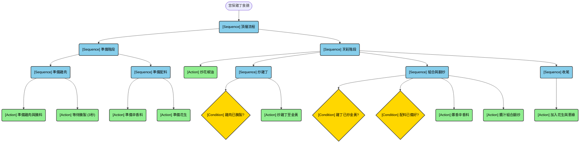

## 假設上述的感知模型已經訓練完成，且達到理想的準確度與可靠性，你接下來會如何將這個模型實際應用在機器人的料理任務流程當中？

我認為，在end-to-end模型的汎用性與穩定性還沒到達一定程度之前，最好的方式之一是使用BehaviorTree，因為料理的每個步驟，比如熱鍋、爆香、炒雞丁，都可以被封裝成一個獨立的、可重複使用的Subtree。未來要增加新菜色，只需要組合或修改這些subtree，不需要為每一個菜色都開發一個模型。

而在第一題中我們有討論到，Perception在料理中扮演的關鍵角色是提供判斷的依據，也因此我認為每一個感知模型代表的就是一個BehaviorTree中的Condition Node，而這個Condition Node將扮演是否要tick某個Subtree或執行某個action的關鍵判斷。

以下以宮保雞丁為例，雞丁已炒金黃，就是一個Perception Condition：

